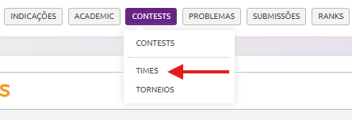

# NExT 2024.2 **Lógica de Programação** com Python
## Aula 10 - 🏃‍➡️ Maratona de Programação

------------------

# 1. Sobre a Maratona de Programação

A Maratona de Programação é um evento voltado para entusiastas da programação, que desafia equipes a resolverem problemas computacionais dentro de um tempo determinado. É uma oportunidade única para testar suas habilidades, trabalhar em equipe e aprender com outros competidores.

## Funcionamento

* Cada equipe terá um conjunto de problemas para resolver;
* Os problemas são de dificuldade variada e devem ser resolvidos programaticamente;
* As soluções devem ser enviadas e avaliadas automaticamente pelo sistema do Beecrowd.

## Pontuação

* **Aceitação Rápida**: Cada problema tem o mesmo peso, e as equipes são ranqueadas pelo número de problemas resolvidos;
* **Desempate**: Caso duas equipes resolvam a mesma quantidade de problemas, o critério de desempate será o tempo total. O tempo total inclui:
    * O tempo gasto para resolver cada problema desde o início da competição;
    * Penalidades de 10 minutos para cada submissão incorreta antes da submissão correta.

# 2. Como Criar um Time e se Inscrever

Siga os passos abaixo para criar um time de até 3 pessoas e se inscrever na maratona:

1. Crie seu time

    * Apenas uma pessoa cadastra o time (o capitão);
    * Faça login no Beecrowd;
    * Clique em `CONTESTS`>`TIMES`. Depois em `Criar Time`;
    * 
    * Escolha um nome criativo para o seu time;
    * Adicione até 2 outros membros (cada membro precisa ter uma conta no Beecrowd).

2. Acesse o link do torneio

    [NExT 23.2 Lógica - Torneio 8824](https://judge.beecrowd.com/pt/tournaments/rank/8824)

3. Palavra-chave para inscrição

    Durante a inscrição, será solicitado uma palavra-chave. Digite a palavra:
`elegante`.

4. Finalize a inscrição

    Confirme os dados do time e certifique-se de que todos os membros estão cadastrados corretamente.

# 3. Detalhes do Evento

* **Data**: 02 de dezembro de 2024
* **Horário**: 19:00 até 21:55.
* **Formato**:
    * Cada time terá uma sala privada no Zoom para discussão e resolução dos problemas;
    * Certifique-se de que todos os membros têm acesso ao Zoom e que a conexão está estável;
    * Recomenda-se o uso microfone e câmera, para comunicação com o grupo.

# 4. Dicas de Estratégias

Aqui estão algumas dicas para ajudar sua equipe a alcançar um bom desempenho:

## Antes da Competição

* **Inscreva-se**: Forme seu time e faça sua inscrição o quanto antes!
* **Pratique**: Resolva problemas no Beecrowd e faça outros exercícios para se manter aquecido;
* **Divisão de Funções**: Decida quem fará o quê durante a competição (por exemplo, um foca na leitura e categorização dos problemas, outro na programação e o terceiro na depuração/teste);
* **Comunique-se**: Treine a comunicação com seus colegas, pois ela será essencial no dia.

## Durante a Competição

* **Leia Todos os Problemas Primeiro**: Comece pelos problemas mais fáceis para garantir pontos rápidos;
* **Administre o Tempo**: Não perca muito tempo em um único problema. Se estiver difícil, peça ajuda e passe para outro;
* **Use Estratégias de Depuração**: Sempre teste sua solução com casos simples antes de enviar;
* **Controle as Submissões**: Evite submissões precipitadas. Certifique-se de que a solução está correta.

## Pós-Competição

* **Reveja o Desempenho**: Após o evento, analise as soluções apresentadas e veja como pode melhorar para as próximas competições.

------------------

Boa sorte e divirtam-se! 🚀

# 👍 Feedback
[Clique aqui](https://docs.google.com/forms/d/e/1FAIpQLSels7ZV4sCx98BSeBx2IJD2rdHLTuPo_5tL3qfdX1Y-BazD7A/viewform) para compartilhar o que você achou deste módulo neste formulário anônimo.

# Lista de questões

1. https://judge.beecrowd.com/pt/problems/view/1024
2. https://judge.beecrowd.com/pt/problems/view/1047
3. https://judge.beecrowd.com/pt/problems/view/1073
4. https://judge.beecrowd.com/pt/problems/view/1101
5. https://judge.beecrowd.com/pt/problems/view/1113
6. https://judge.beecrowd.com/pt/problems/view/1133
7. https://judge.beecrowd.com/pt/problems/view/1143
8. https://judge.beecrowd.com/pt/problems/view/1159
9. https://judge.beecrowd.com/pt/problems/view/1165
10. https://judge.beecrowd.com/pt/problems/view/1180
11. https://judge.beecrowd.com/pt/problems/view/1215
12. https://judge.beecrowd.com/pt/problems/view/1244
13. https://judge.beecrowd.com/pt/problems/view/1272
14. https://judge.beecrowd.com/pt/problems/view/1551
